# 💸 Expense Manager (Splitwise-like App) – Oracle APEX

## 📌 Overview

Expense Manager is a web-based application built using Oracle APEX that helps users manage shared expenses within groups. It allows users to create groups, add expenses, and automatically calculates balances to determine who owes whom. The application simplifies expense tracking and provides clear financial insights.

---

## 🚀 Features

* 👥 Create and manage groups
* ➕ Add and split expenses among group members
* 💰 Automatic balance calculation (who owes whom)
* 📊 Category-wise expense tracking
* 📈 Expense summary and visualization
* 🔄 Real-time updates using APEX dynamic features

---

## 🏗️ Architecture

The application follows a 3-layer architecture:

* **APEX UI Layer** → Pages, Forms, Reports, Charts
* **PL/SQL Logic Layer** → Business logic, balance calculation, dynamic content
* **Database Layer** → Tables, relationships, and constraints

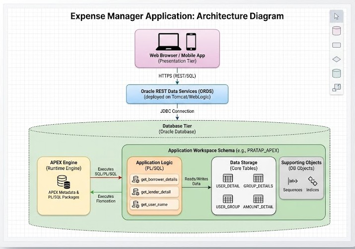

---

## 🧩 Database Design (ER & data Flow Diagram)

The system is designed using a normalized relational schema:

* `USER_DETAIL` → Stores user information
* `GROUP_DETAILS` → Stores group details
* `USER_GROUP` → Maps users to groups
* `EXPENSE` → Stores expense details
* `AMOUNT_DETAIL` → Stores split transactions (borrower & lender)

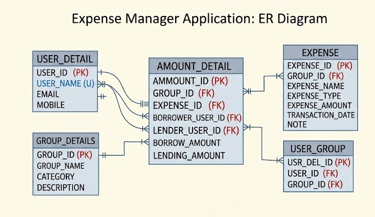

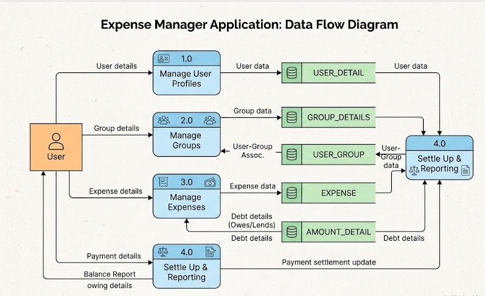

---

## 🔄 Application Flow

1. User logs into the application
2. Creates or selects a group
3. Adds members to the group
4. Records expenses
5. Expense is split among users
6. System calculates balances
7. Users can view reports and settlement details

---

## 📸 Screenshots

### 🔐 Login Page

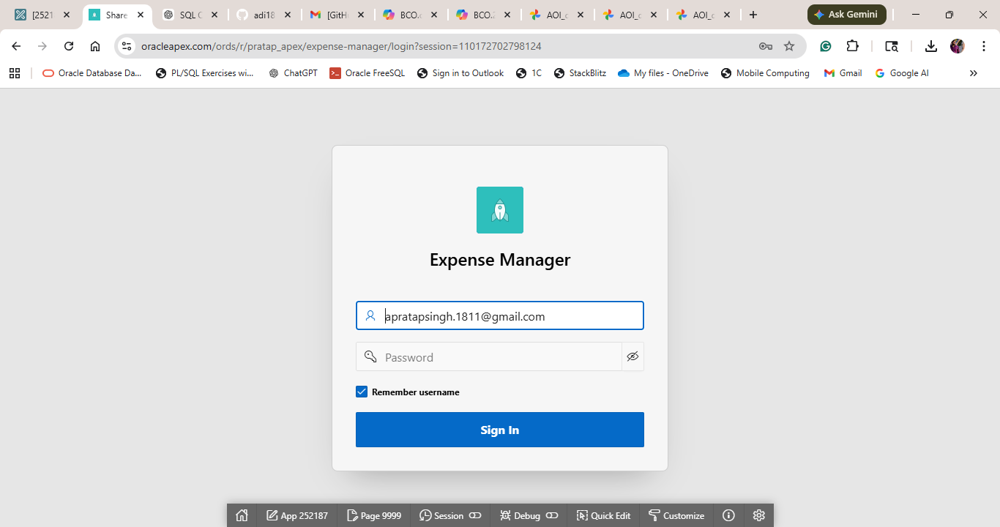

### 🏠 Home / Groups Page

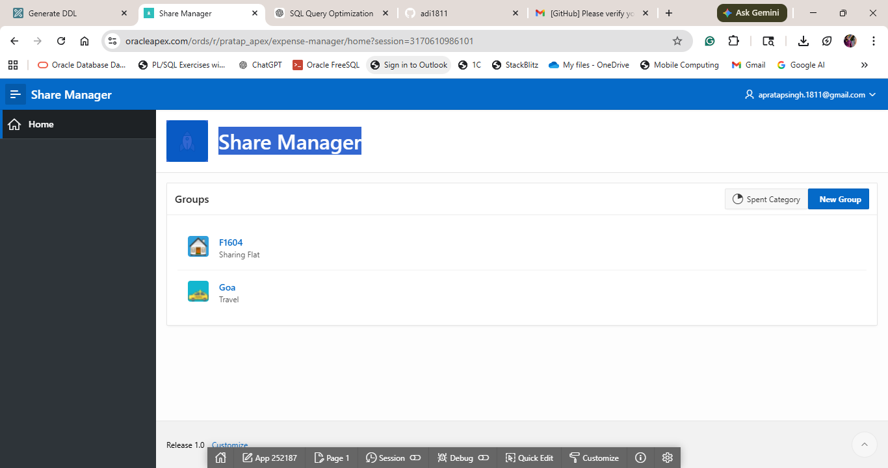

### ➕ Create New Group

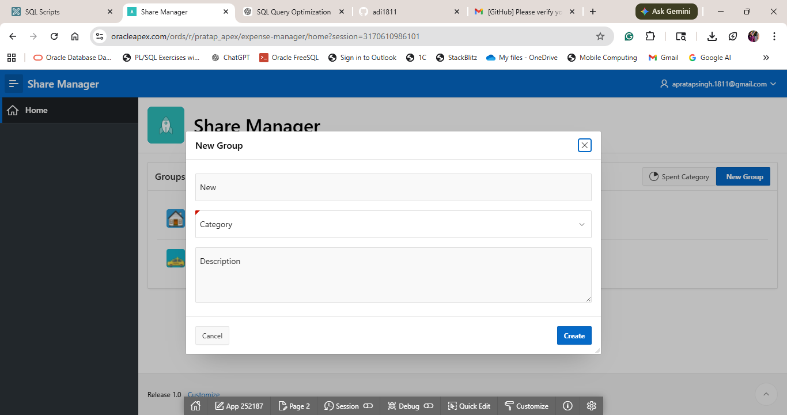

### 📊 Individual Expense View

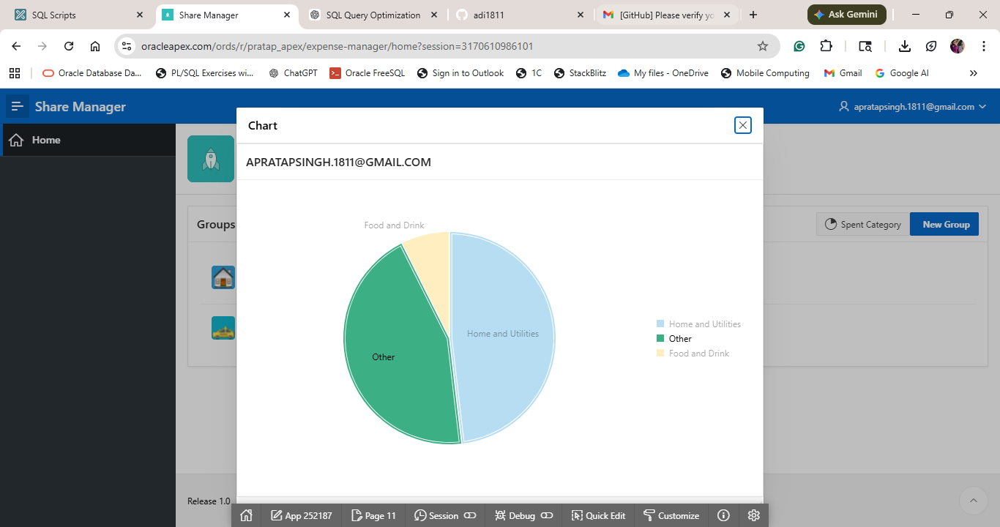

### 👥 Group Expense Page

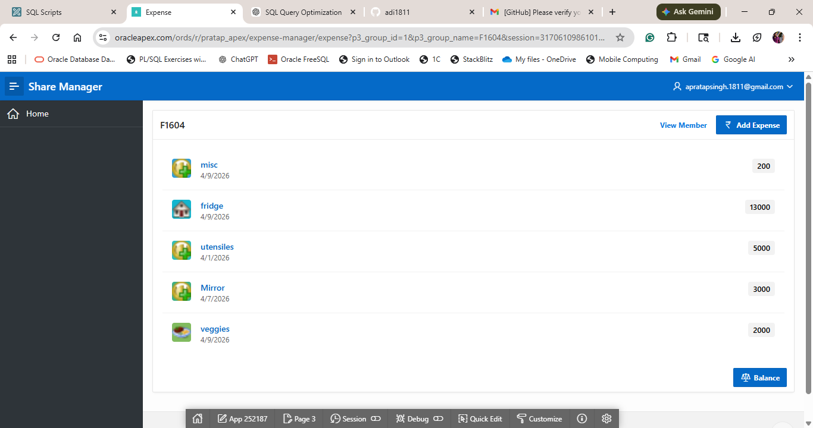

### ➕ Add Expense

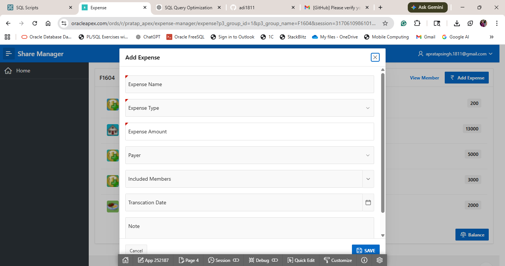

### 💸 Balance Report

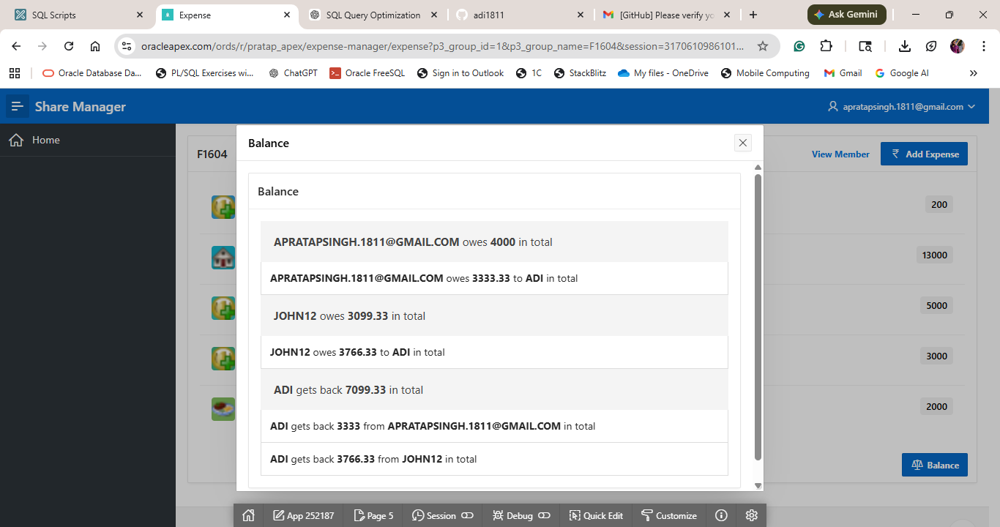

### 👤 Group Members

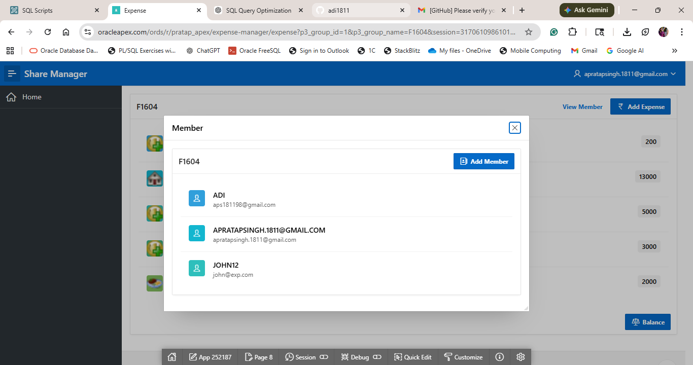

### ➕ Add Member

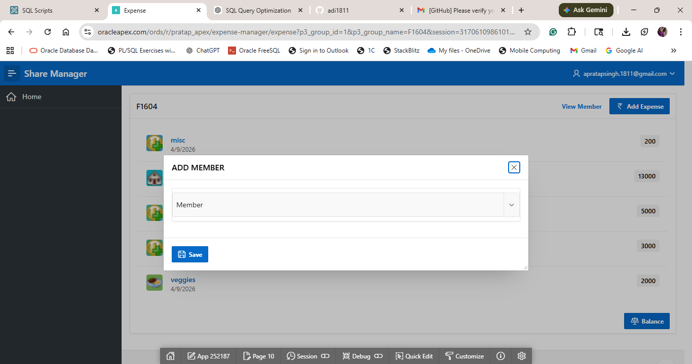

### 📈 Expense Summary

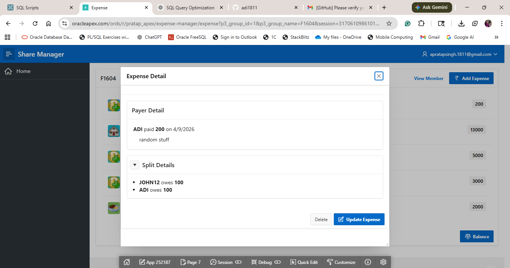

---

## 🛠️ Tech Stack

* Oracle APEX
* PL/SQL
* SQL
* Oracle Database

---

## ▶️ How to Run

1. Import database schema:

   * Run `db/schema.sql` in Oracle Database

2. Import APEX application:

   * Go to APEX → App Builder → Import
   * Upload file from `app/` folder

3. Run the application

---

## 🧠 Key Highlights

* Implemented complex SQL queries for balance calculation
* Designed normalized relational database schema
* Built dynamic UI using PL/SQL-generated content (CLOB)
* Developed Splitwise-like settlement logic
* Integrated reporting and visualization features

---

## 👨‍💻 Author

Aditya Pratap Singh
